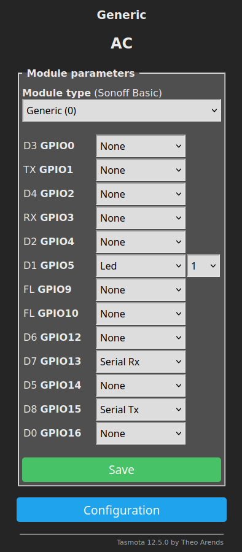

# Hacking AC Wifi Protocol

- Many ACs come with a Wifi module to connect them to the (chinese) cloud and control them from everywhere.
- Some makes are Kesser, but parts have TCL markings. I suppose a lot of other makes/rebrands have identical hardware.
- This is an approach to reverse engineer the protocol used for control from the cloud.
- I was successful to reassemble the whole functionality and liberating the AC from the cloud.

## The module

- Spare Part Number: 32001-000140
- [Tuya module](https://developer.tuya.com/en/docs/iot/wifie1smodule?id=K9605thnvg3e7)
- Connects to Tuya Cloud / Controlled via Tuya App
- It is connected via UART to the main board
- Brands using this module/protocol
  - Kesser
  - TCL
  - Pioneer
  - DAIZUKI
  - ... -> Tell me
- Pics
  - [Connector on the main board](doc/connector_main_board.jpg)
  - [Diagramm of main board](doc/diagramm_main_board.jpg)
  - [Wifi board top](doc/board_top.jpg)
  - [Wifi board bottom](doc/board_bottom.jpg)
  - [Housing](doc/module_in_housing.jpg)

## Reverse engineering the protocol

- Logic analyzer -> UART, Baudrate 9600, Bits 8, Parity Even, Stop-Bits 1 -> 9600 8E1
- Reverse engineering of the protocol was done by using the original app and the IR remote control.

## The protocol

### The General Structure

| Position (byte[bits]) | 0        | 1                            | 2                                | 3                                                                       | 4                  | 5:X          | X+1                   |
| :-------------------- | :------- | :--------------------------- | :------------------------------- | :---------------------------------------------------------------------- | :----------------- | :----------- | :-------------------- |
| **Description**       | Preamble | Response Flag                | Request Flag                     | Command                                                                 | Payload Length     | Payload      | Checksum              |
| **Values**            | 0xBB     | 0x01 if sent by AC else 0x00 | 0x01 if sent by module else 0x00 | 0x03: Set   0x04: Get   0x05: Display   0x09: ??   0x0A: ?? | Depends on command | See commands | CRC8 with Polynom = 1 |

Example: `BB 00 01 04 02 01 00 BD`

-- Response cmd = req cmdid

### Commands

#### 0x03: Set Values

**Request**:

| Position (byte[bits]) | 3       | 4              | 7[0]            | 7[1]            | 7[2]            | 7[3]    | 7[4:7]              | 8[0:3]                                                     | 8[4:7]                                                                                |
| :-------------------- | :------ | :------------- | --------------- | --------------- | --------------- | ------- | ------------------- | ---------------------------------------------------------- | ------------------------------------------------------------------------------------- |
| **Description**       | Command | Payload Length | Eco Mode        | 7-Seg Display   | Buzzer          | Unknown | Power               | Extended Mode                                              | Mode                                                                                  |
| **Values**            | 0x03    | 29 = 0x1D      | 1: On 0: Off | 1: On 0: Off | 1: On 0: Off | 0       | 0x4: On 0x0: Off | 0x0: normal 0x1: health 0x4: turbo 0x8: low noise | 0x01: heating 0x02: dehumification 0x03: cooling 0x07: venting 0x08: auto |

| Position (byte[bits]) | 9[0:3]  | 9[4:7]                          | 10[0]           | 10[1]   | 10[2:4]                 | 10[5:7]                                                           | 11[0:3] | 11[4]            | 11[5]   | 11[6]              | 11[7]   |
| :-------------------- | :------ | :------------------------------ | --------------- | ------- | ----------------------- | ----------------------------------------------------------------- | ------- | ---------------- | ------- | ------------------ | ------- |
| **Description**       | Unknown | Temperature (°C)                | 8° Heater       | Unknown | Move Vert. Vane         | Fan Speed                                                         | Unknown | Move Horiz. Vane | Unknown | Temperature (deci) | Unknown |
| **Values**            | 0x5     | 0xF + 16 - T   T in [16..31] | 1: On 0: Off | 0       | 0b111: On 0b000: Off | 0x00: auto 0x02: 1 0x06: 2 0x03: 3 0x07: 4 0x05: 5 | 0       | 1: On 0: Off  | 0       | 0: .0°C 1: .5°C | 0       |

| Position (byte[bits]) | 12-19[0:5] | 19[6:7]                                                              | 20-31   | 32                                                                                                                                                                                 | 33                                                                                                                                                                                                               |
| :-------------------- | :--------- | -------------------------------------------------------------------- | ------- | ---------------------------------------------------------------------------------------------------------------------------------------------------------------------------------- | ---------------------------------------------------------------------------------------------------------------------------------------------------------------------------------------------------------------- |
| **Description**       | Unknown    | Sleep Mode                                                           | Unknown | Vert. Vane Position                                                                                                                                                                | Horiz. Vane Position                                                                                                                                                                                             |
| **Values**            | all 0      | 0b00: Off 0b01: default 0b10: old people? 0b11: young people? | all 0   | 0x00: N/A 0x01: Fix top 0x02: Fix upper 0x03: Fix mid 0x04: Fix lower 0x05: Fix bottom 0x08: Move full range 0x10: Move upper range 0x18: Move lower range | 0x80: N/A 0x81: Fix left 0x82: Fix mid left 0x83: Fix mid 0x84: Fix mid right 0x85: Fix right 0x88: Move full range 0x90: Move left range 0x98: Move mid range 0xA0: Move right range |
|                       |

Example: `BB 00 01 03 1D 00 00 64 01 59 07 00 00 00 00 00 00 00 00 00 00 00 00 00 00 00 00 00 00 00 00 00 00 80 1F`

**Response**:

| Position (byte[bits]) | 3            | 4              | 7[0:3]                                        | 7[4:7]                                                                                | 8[0:3]                                                      | 8[4:7]          | 9                      | 10[0:3]                                                                   | 10[4:7]:59                                                                                                                        |
| :-------------------- | :----------- | :------------- | :-------------------------------------------- | :------------------------------------------------------------------------------------ | :---------------------------------------------------------- | :-------------- | :--------------------- | :------------------------------------------------------------------------ | :-------------------------------------------------------------------------------------------------------------------------------- |
| **Description**       | Command      | Payload Length | Status                                        | Mode                                                                                  | Fan Speed                                                   | Set Temperature | Temperature (deci)     | Vanes                                                                     | Unknown Data (Diagnosis?)                                                                                                         |
| **Values**            | 0x03 or 0x04 | 55 = 0x37      | 0x2: Off 0x3: On 0x7: Eco 0xb: Turbo | 0x01: cooling 0x02: venting 0x03: dehumification 0x04: heating 0x05: auto | 0x8: Auto 0x9: 1 0xc: 2 0xa: 3 0xd: 4 0xb: 5 | T = X + 16      | 0x0: .0°C 0x2: .5°C | 0b0000: fixed 0b0010: horizontal moving 0b0100: vertical moving  | Probably a lot of interesting stuff, like actual temperatures, pressures and power. Hard to reverse engineer without a reference. |

Example: `BB 01 00 03 37 04 00 34 D6 00 00 00 00 00 00 00 00 73 03 88 00 00 00 00 00 00 00 00 00 00 91 FF 40 00 6C 1F 1B 4F 52 18 CA 00 00 00 00 E0 01 00 00 44 40 00 00 00 00 1A 00 00 00 00 E6`

#### 0x04: Get Values

**Request**:

| Position (byte[bits]) | 3       | 4              | 5       | 6       |
| :-------------------- | :------ | :------------- | ------- | ------- |
| **Description**       | Command | Payload Length | Unknown | Unknown |
| **Values**            | 0x04    | 2 = 0x02       | 0x01    | 0x00    |

Example: `BB 00 01 04 02 01 00 BD`

**Response**:

Same as for Get command, except that the command code in the response is 0x04.

#### 0x05: Set Display

**Request**:

| Position (byte[bits]) | 3       | 4              | 5:13[0:3] | 13[4:7]                                  |
| :-------------------- | :------ | :------------- | --------- | ---------------------------------------- |
| **Description**       | Command | Payload Length | Unknown   | Display                                  |
| **Values**            | 0x05    | 9 = 0x09       | 0x00      | 0x1: AP 0x2: SA 0x4: PP 0x8: CF |

Example: `BB 00 01 05 09 00 00 00 00 00 00 00 00 01 B7`

**Response**:

| Position (byte[bits]) | 3       | 4              | 5       | 6:15[0:3] | 15[4:7]                                  |
| :-------------------- | :------ | :------------- | ------- | --------- | ---------------------------------------- |
| **Description**       | Command | Payload Length | Unknown | Unknown   | Display                                  |
| **Values**            | 0x05    | 11 = 0x0b      | 0x04    | 0         | 0x1: AP 0x2: SA 0x4: PP 0x8: CF |

Example: `BB 01 00 05 0B 04 00 00 00 00 00 00 00 00 00 01 B1`

#### 0x09: Unknown

**Request**:

Example: `BB 00 01 09 02 05 00 B4`

**Response**:

Example: `BB 01 00 09 2D 04 00 00 00 00 00 00 FF 00 00 00 00 00 FF FF 00 00 00 00 00 00 F0 FF 00 00 00 00 00 00 00 00 00 00 00 00 00 00 00 00 00 00 00 00 00 00 6A`

#### 0x0A: Unknown

**Request**:

Example: `BB 00 01 0A 03 05 00 00 B6`

**Response**:

Example: `BB 01 00 0A 2D 04 00 04 00 00 00 00 00 00 00 00 00 00 00 00 00 00 00 00 00 00 00 00 00 00 00 00 00 00 00 00 00 00 00 00 00 00 00 00 00 00 00 00 00 00 9D`

## Adding to home automation

- Using [Tasmota](https://github.com/arendst/Tasmota)
  - Console: `SerialConfig 8E1`, `Baudrate 9600`
  - 
- [MQTT Bridge](ac_control.py)
- MQTT dashboard (tbd)
